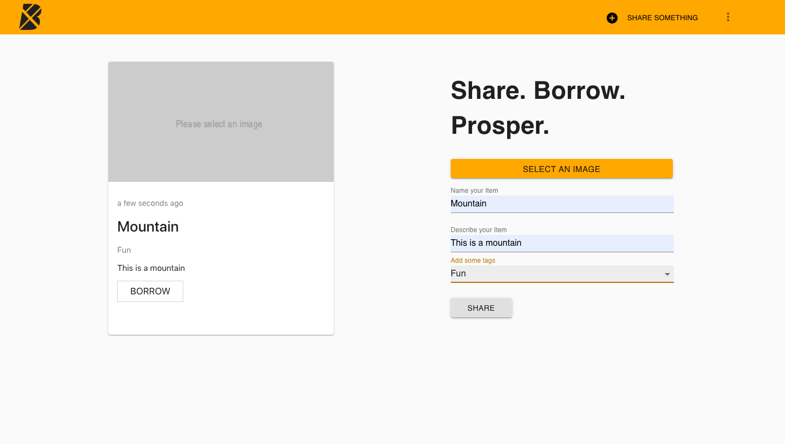
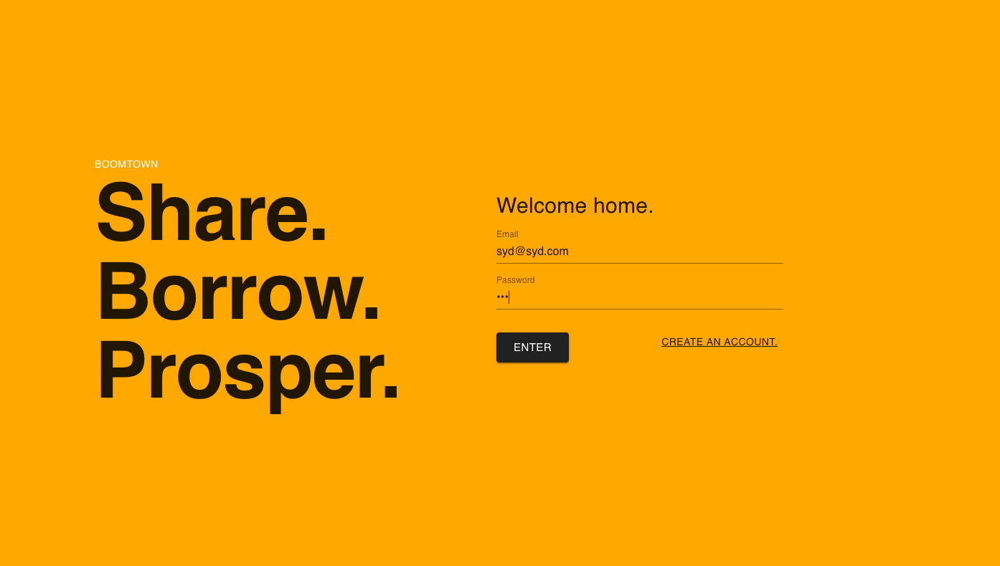
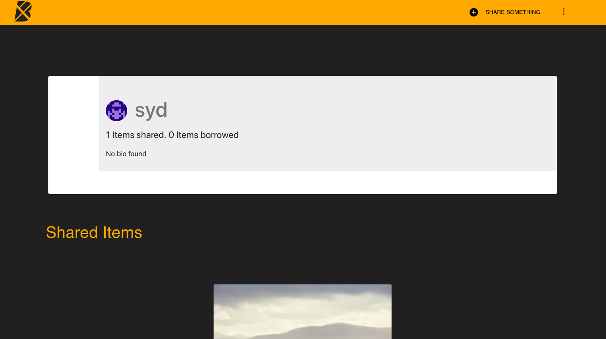

# Boomtown 🏙

## Information

Utilizing PostgreSQL database to support server side for this aplication to support a sharing economy, with Apollo
Created a database through PostGreSQL to support a sharing economy for the application.
Created predominantly using react and redux, supports this sharing economy on the front end of this application.
A user creates an account (or logs in with an existing account), to be displayed items that can be borrowed from other users. The user can also add their own items to the items database, displayed on the share and profile page

## Technologies and/or Libraries Used

- Apollo Server (library that helps connect GraphQL schema to the server in Node.js)
- Express Library (web application framework for Node.js, designed for building web applications and API's)
- GraphQL (query language for the applications client-facing API)
- React (JavaScript library for building user interfaces)
- Redux (JavaScript library for managing application state)

## Screenshots





## Server

Commands must be run from the `server` directory:

### Installation

```bash
npm install
```

### Run

```bash
npm run start:dev
```

## Client

Commands must be run from the `client` directory:

### Installation

```bash
npm install
```

### Run

```bash
npm start
```

### Build

```bash
npm run build
```

### Tests

Just linting:

```bash
npm run lint
```

Run linting, and fix any errors:

```bash
npm run lint:fix
```

Run all tests:

```bash
npm run test
```

### Author

Sydney Douglas, https://github.com/sydneydou
